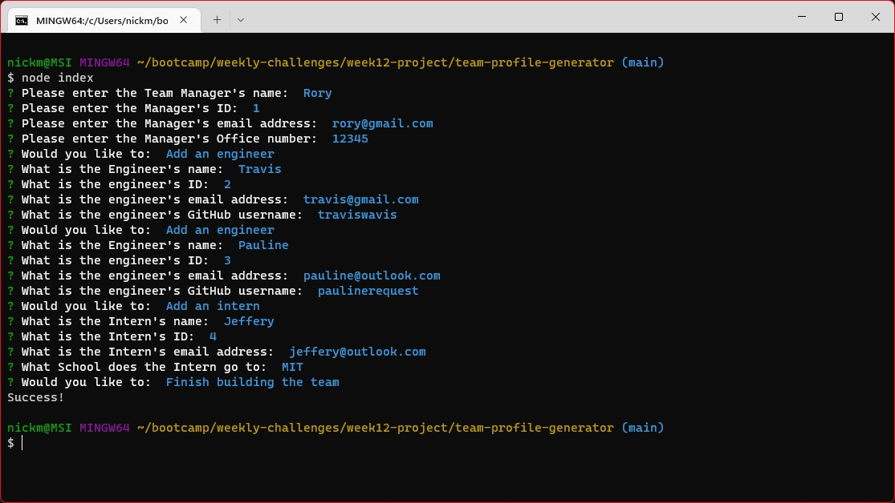
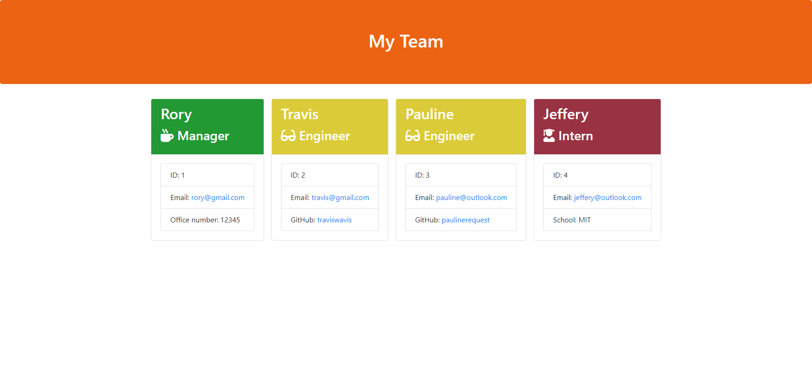

  # Team Profile Generator

  ## Description

  This Node application takes in information about a team of developers and generates an HTML file that displays all the information taken about the team, to give the user quick access to the teams email addresses and GitHub accounts.

  I built this app so that the user has information about their development team all in one place, they can then easily find the information about each person in one place.

  I used JavaScript and Node JS, within Node JS I used the modules Jest, for testing, and Inquirer, to take in user inputs.  The file generated by this application uses HTML, CSS and BootStrap.  I used Node so that the application could be run from the command line rather than running JavaScript in the browser.

  I found Inquirer a little difficult when trying to implement validation on user inputs.  I have currently left this out of the project, but will look into this, as I think it will be very valuable to have.  I found the documentation for Inquirer is not very explanitory.  It has examples but doesn't explaint these well.

  I have learnt more about classes and subclasses.  In the beginning I understood classes on a basic level, but subclasses confused me a little.  After working with them a bit more, I now understand how they work a bit better.

  In the future I would like to add the validation that I mentioned earlier.  Maybe an edit feature, so you can edit members of the team if anything changes, such as people leaving, new members, someone's email address changes, instead of having to generate a whole new file.

  ### Links

  Repo: [Team Profile Generator](https://www.github.com/nickmbk/team-profile-generator)

  Sample Page: [Sample page generated by app](https://nickmbk.github.io/tpg-team-page/)

  ## Table of Contents

  - [Installation](#installation)
  - [Usage](#usage)
  - [Credits](#credits)
  - [License](#license)
  - [Tests](#tests)
  - [Questions](#questions)

  ## Installation

  Download the code from the repo, by clicking on the repo link below, then clicking the green Code button and then Download Zip. Unzip the file and open the terminal. Alternatively you can clone the repo to your system and open the terminal. In the terminal use the command `npm i` to install the dependancies. Once installed, run the command `node index`. This will run the application and you will be prompted with questions, from which the answers will generate the HTML file that will display your team.

  Repo: [Team Profile Generator](https://www.github.com/nickmbk/team-profile-generator)

  ## Usage

  Once you run the application, see [Installation](#installation), you will be presented with some questions. 
  
  The first lot of questions are about the team Manager:
  - the manager\'s name
  - their ID number
  - their email address
  - their office number
  
  You will then be asked to choose an option,
  - Add an engineer
  - Add an intern
  - Finish building the team
  
  Choosing Add an engineer will display the folowing questions:
  - Engineer's name
  - their ID
  - their email
  - their GitHub username
  
  Choosing Add an intern will present you with:
  - Intern's name
  - their ID
  - their email
  - their school
  
  When you have finished select Finish building the team and your HTML file will be generated into the 'output' folder

  Screenshot of the command line running the app:
  

  Screenshot of the HTML file generated by the app:
  

  [Sample page generated by app](https://nickmbk.github.io/tpg-team-page/)

  ## Credits

  ### Resources
  
  #### Inquirer Documentation
  https://github.com/SBoudrias/Inquirer.js
  #### BootStrap Documentation
  https://getbootstrap.com/docs/4.3/getting-started/introduction/
  #### Node Documentation
  https://nodejs.org/en/docs/
  #### JavaScript Classes 
  - https://www.w3schools.com/js/js_classes.asp 
  - https://developer.mozilla.org/en-US/docs/Web/JavaScript/Reference/Classes

  ## License
  

  

  This project uses the MIT License.

  ## Tests

  Users can run the tests used to develop the app by using the command `npm test` on the command line

  ## Questions

  Please contact me if you have any questions:

  Nicholas Misselbrook

  [nick.mbk@hotmail.com](nick.mbk@hotmail.com)

  [GitHub: nick,bk](https://www.github.com/nick,bk)

  